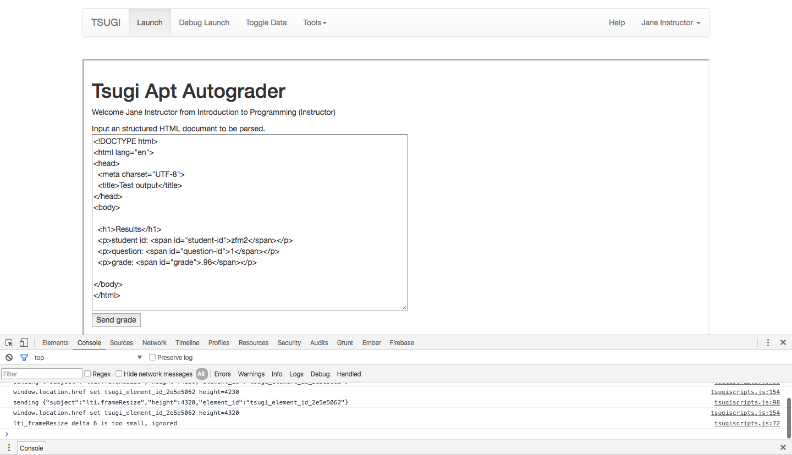
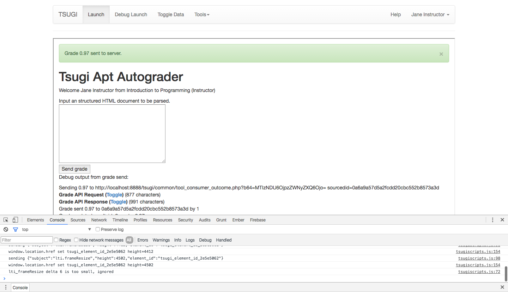

# Tsugi APT Autograder

This is a simple [https://github.com/csev/tsugi](tsugi) autograder module to wrap Duke's APT grading application. It is being written as a final project for an open sources class on sakai taught by Robert Duvall (CS-290S).

Currently all the app does is take in an HTML document as plaintext and pull out the structured data inside, submitting it to a server via LTI. This behavior is shown below:

